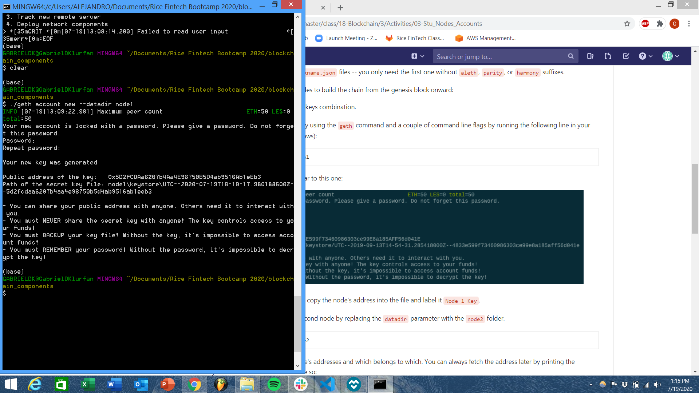
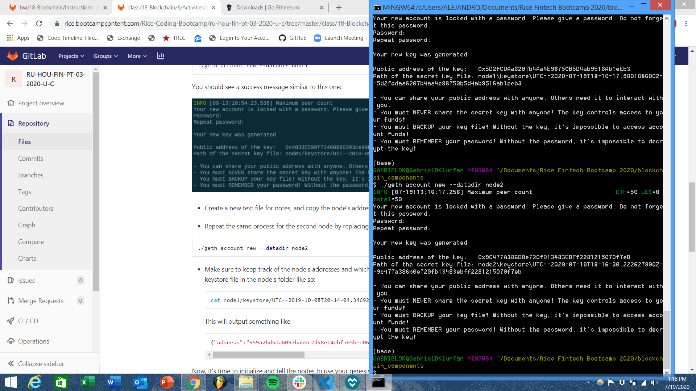
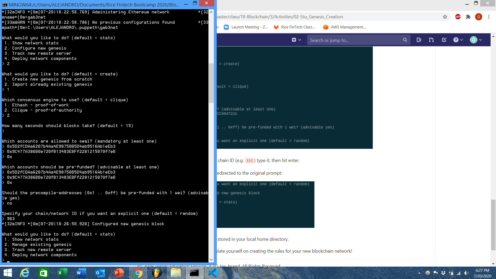
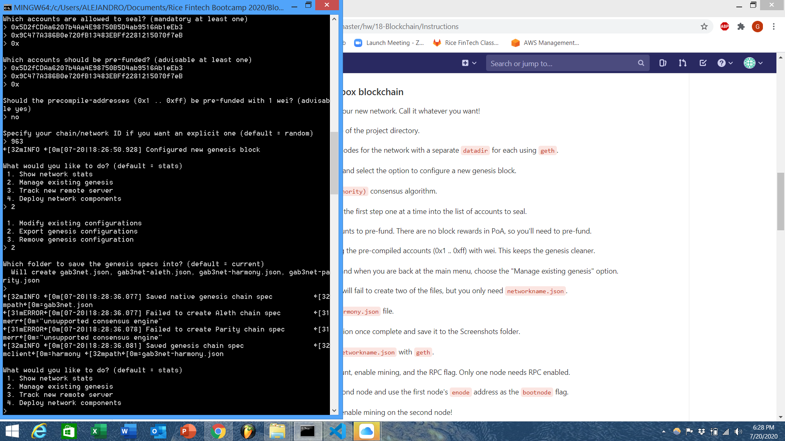
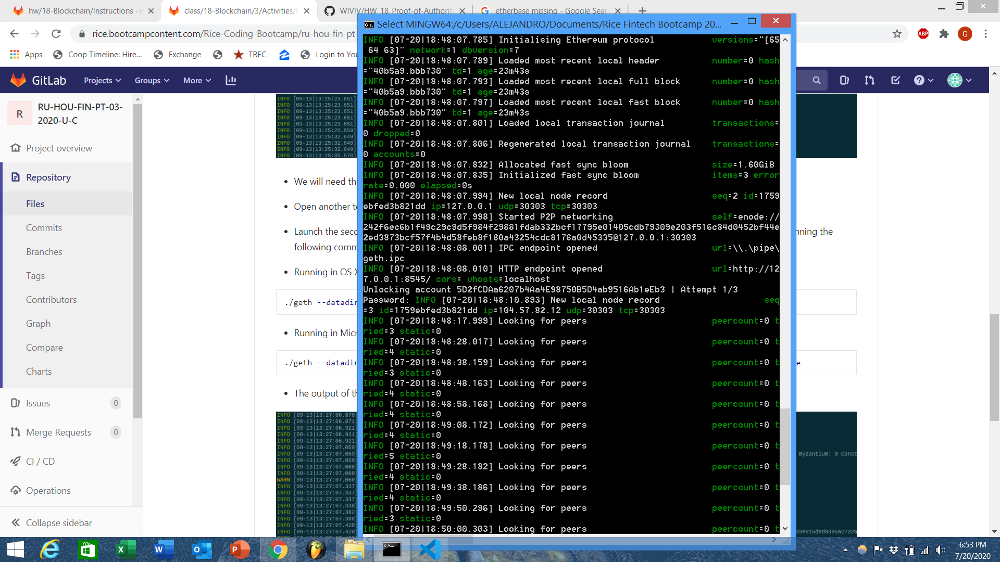
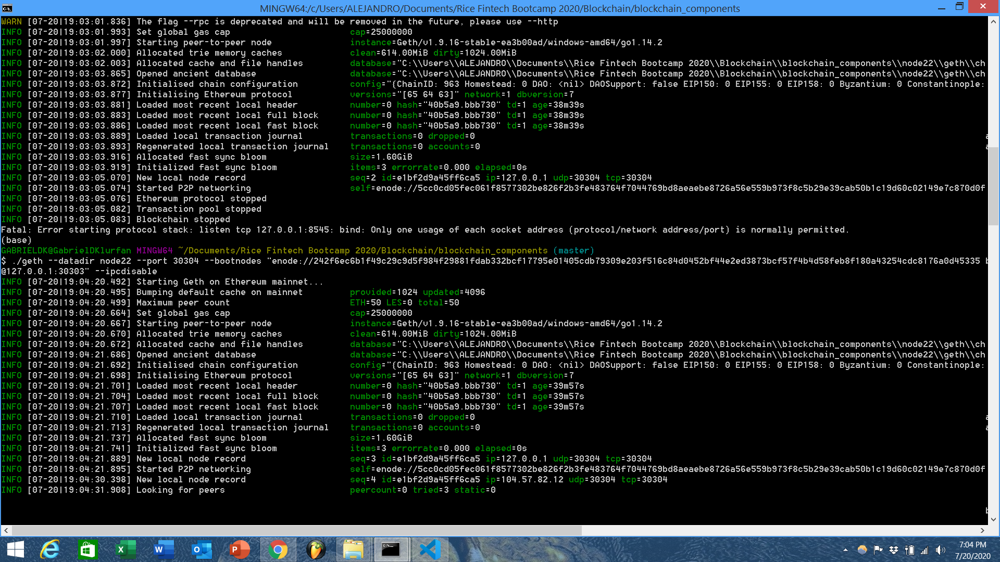

# Accessing Gab3net: Blockchain
## Initial Blockchain Setup
- To create and access the gab3net, you will need a MyCrypto wallet as well as the geth and puppeth applications.
- Create accounts for two (or more) nodes for the network with a separate datadir for each using geth.

- The genesis block will be created on a Proof of Work system
-Use both node accounts in the creation of the Genesis block and export network creation

# Gab3net Setup
- Use Node1 and Node2 to create a Proof of Authority system using the account addresses to prefund.
- Repeat the process to export the network.
- Initialize each node with the new networkname.json with geth.

- Run the first node, unlock the account, enable mining, and the RPC flag. Only one node needs RPC enabled.
- Set a different peer port for the second node and use the first node's enode address as the bootnode flag.

